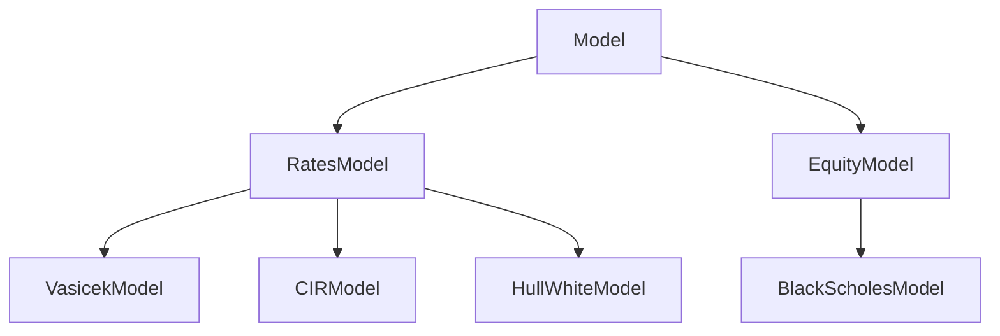

# Cutting-Edge Project - Milliman

&nbsp;&nbsp;&nbsp;&nbsp;

## Overview

*Project conducted in collaboration with [Milliman](https://www.milliman.com/en/)*.


## Architecture



## Getting started

```bash
python3 --version
pip3 -V
pip3 install -r requirements.txt
```

## References

## License

[See `LICENSE` file](LICENSE)
- **Amal BACHA - Dalia BARBI - Khalil BATTIKH - Lucas RODRIGUEZ - Naïm SOUNI**
- *Academic works (January 2023 - Present)*
