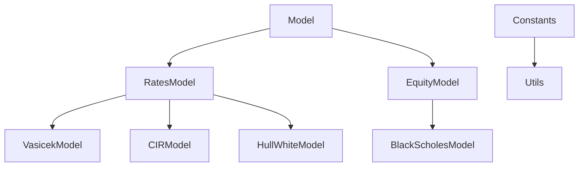

# Cutting-Edge Project - Milliman

&nbsp;&nbsp;&nbsp;&nbsp;

## Overview

1. Implementation of path simulators for:
    - Interest rates models: Vasicek, Cox-Ingersoll-Ross (CIR), Hull & White
    - Equity-index models: Black-Scholes with stochastic rates
    - Use of Euler-Maruyama and Milstein numerical methods to solve SDEs dynamics
2. Analysis via derivatives pricing 


*Project conducted in collaboration with [Milliman](https://www.milliman.com/en/)*.


## Architecture

The dependency tree below shows the links between each declared class in the source code.



**Remark**: `Model`, `RatesModel` and `EquityModel` are *abstract* classes and do not contain any implemented methods.

## Getting started

0. Clone the repository:
```bash
git clone git@github.com:lcsrodriguez/CuttingEdge-Milliman.git
cd CuttingEdge-Milliman/
```

One can also download the repository by clicking on the green button **Code** > **Download ZIP**.

1. Verify the requirements to execute the Jupyter Notebook
```bash
python3 --version
pip3 -V
pip3 install -r requirements.txt
```

2. Run the Jupyter-Notebook 
```bash
jupyter-notebook main.ipynb
```

3. Check and handle the figures stored in `out/`:
```bash
ls out/
cd out/
```

### Build the documentation

1. Install these additional requirements
```bash
pip3 install mkdocs "mkdocstrings[python]" mkdocs-material
```

2. Convert the Jupyter Notebook file (`.ipynb` extension) into a Python script file (`.py`)
```bash
jupyter nbconvert --to script main.ipynb --output out/main
cat out/main.py
```

3. Perform the needed updates in the code

4. Run the following command to release the last version of the documentation 
```bash
mdkocs build
```

## References

1. Ioane MUNI-TOKE, *Modèles stochastiques de taux d’intérêts*, 2011
2. Lionel GABET, Frédéric ABERGEL, Ioane MUNI-TOKE, *Introduction aux mathématiques financières*, 2010
3. Black, Fischer, and Myron Scholes. *The pricing of options and corporate liabilities.*, Journal of political economy 81.3 (1973): 637-654.
4. Cox, J. C., Ingersoll, J. E., and Ross, S. A. (1985). *A theory of the term structure of interest rates*. Econometrica 53(2), 385–407
5. Grzelak, L. A., and Oosterlee, C. W. (2011). *On the Heston model with stochastic interest rates*. SIAM Journal on Financial Mathematics 2(1), 255–286.

## License

[See `LICENSE` file](LICENSE)
- **Amal BACHA - Dalia BARBI - Khalil BATTIKH - Lucas RODRIGUEZ - Naïm SOUNI**
- *Academic works (January 2023 - Present)*