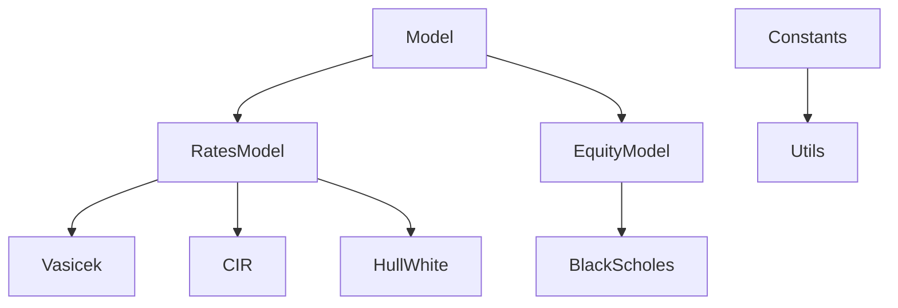

# Project architecture

## Dependency tree





!!! note "Remark"
    `Model`, `RatesModel` and `EquityModel` are *abstract* classes and do not contain any implemented methods.


## File tree

!!! note "Remark"
    To reproduce this graph, please run `tree -L 3 -I 'site|*__' >> ~/tmp/out_tree` for instance to write the formatted tree into the file `out_tree`.

```
.
├── LICENSE
├── Makefile
├── README.md
├── TODO.md
├── docs
│   ├── architecture.md
│   ├── bibliography.md
│   ├── gen_ref_pages.py
│   ├── getting-started.md
│   ├── index.md
│   ├── javascripts
│   │   └── mathjax.js
│   └── styles
│       └── custom.css
├── main.ipynb
├── mkdocs.yml
├── out
│   └── main.py
├── requirements.txt
└── src
    ├── BlackScholes.py
    ├── CIR.py
    ├── Constants.py
    ├── EquityModel.py
    ├── HullWhite.py
    ├── Model.py
    ├── RatesModel.py
    ├── Utils.py
    └── Vasicek.py

5 directories, 24 files
```