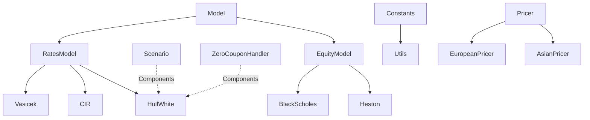

# Project architecture

## Dependency tree





!!! note "Remark"
    `Model`, `RatesModel` and `EquityModel` are *abstract* classes and do not contain any implemented methods.

## UML diagrams

!!! warning "Update"
    To update these graphs, please run, from the root directory, `make graph`.

### UML class diagram 

<div class="img-demo">
    
</div>

[Download](img/uml/classes.png)

### UML package diagram

<div class="img-demo">
    
</div>

[Download](img/uml/packages.png)

## File tree

!!! warning "Update"
    To reproduce this graph, please run `tree -L 3 -I 'site|*__' >> ~/tmp/out_tree` for instance to write the formatted tree into the file `out_tree`.

```linenums="1" hl_lines="6 8 26 31 37 41 57 63"
.
├── LICENSE
├── Makefile
├── README.md
├── RELEASES.md
├── assets
│   └── data
├── docs
│   ├── architecture.md
│   ├── bibliography.md
│   ├── documents.md
│   ├── gen_ref_pages.py
│   ├── getting-started.md
│   ├── git.md
│   ├── how-to.md
│   ├── img
│   │   ├── Milliman.png
│   │   ├── UPS.png
│   │   ├── screens
│   │   └── uml
│   ├── index.md
│   ├── javascripts
│   │   └── mathjax.js
│   └── styles
│       └── custom.css
├── export
│   ├── CV_MC.pkl
│   └── PARALLEL_MC_EXEC-TIMES.pkl
├── main.ipynb
├── mkdocs.yml
├── notebooks
│   ├── README.md
│   ├── analysis.ipynb
│   ├── equity_models.ipynb
│   ├── pricers.ipynb
│   └── rate_models.ipynb
├── out
│   └── main.py
├── out.txt
├── requirements.txt
├── src
│   ├── AsianPricer.py
│   ├── BlackScholes.py
│   ├── CIR.py
│   ├── Constants.py
│   ├── EquityModel.py
│   ├── EuropeanPricer.py
│   ├── Heston.py
│   ├── HullWhite.py
│   ├── Model.py
│   ├── Pricer.py
│   ├── RatesModel.py
│   ├── Scenario.py
│   ├── Utils.py
│   ├── Vasicek.py
│   └── ZeroCouponHandler.py
├── test
│   ├── hw_test.ipynb
│   ├── mp.py
│   ├── out
│   ├── test_import.ipynb
│   └── test_mp.ipynb
└── uml
    ├── classes.png
    └── packages.png

14 directories, 50 files
```