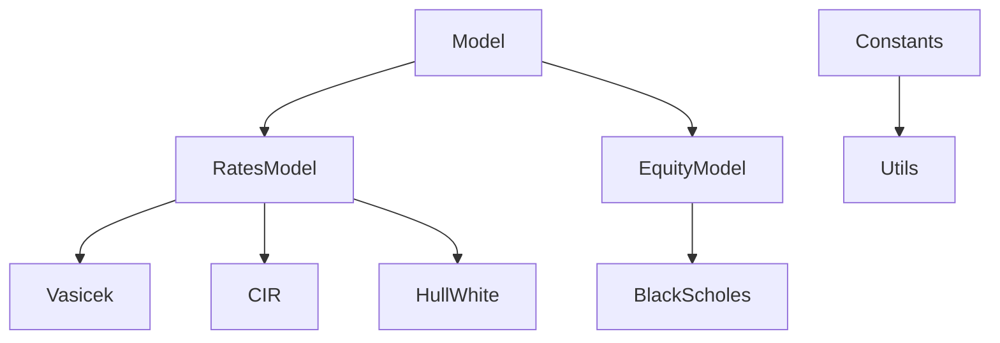

# Project architecture

## Dependency tree





!!! note "Remark"
    `Model`, `RatesModel` and `EquityModel` are *abstract* classes and do not contain any implemented methods.


## File tree

!!! note "Remark"
    To reproduce this graph, please run `tree -L 3 >> ~/tmp/out_tree` for instance to write the formatted tree into the file `out_tree`.

```
.
├── LICENSE
├── README.md
├── TODO.md
├── docs
│   ├── index.md
│   ├── reference.md
│   └── tree.md
├── main.ipynb
├── mkdocs.yml
├── out
│   └── main.py
├── requirements.txt
└── src

3 directories, 10 files
```